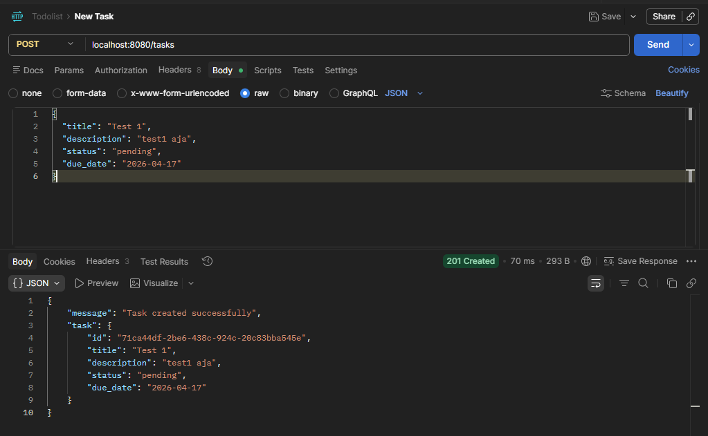
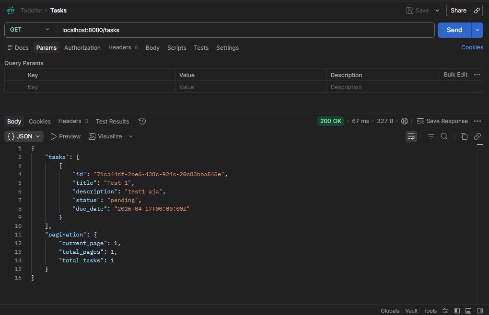
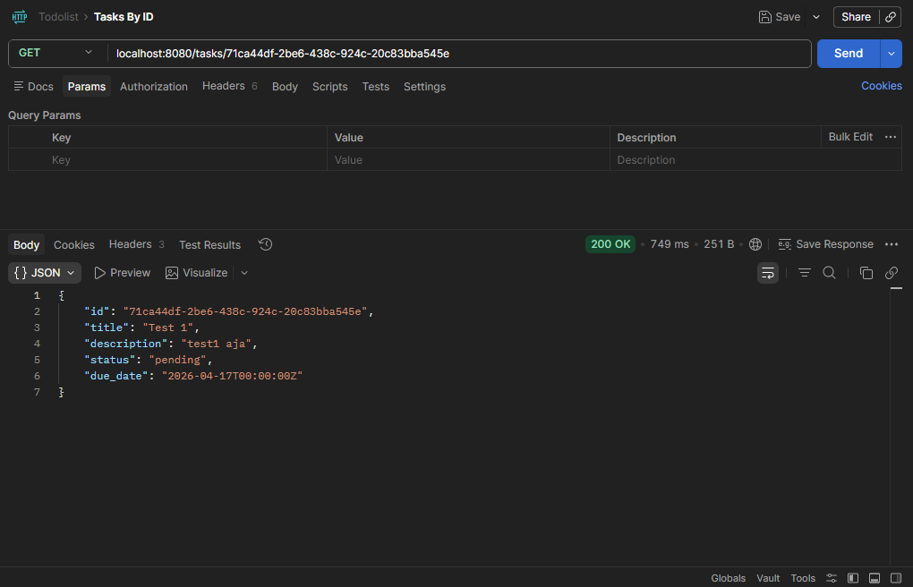
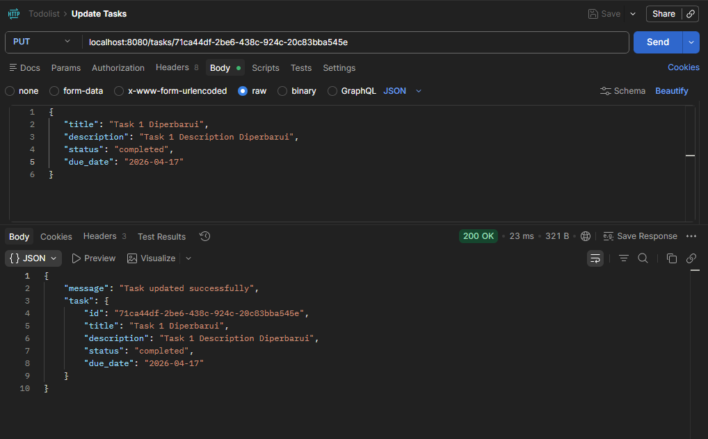
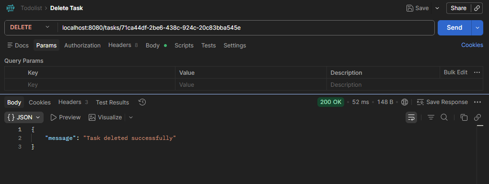

# Simple Todolist
REST API sederhana untuk mengelola tugas dengan fitur CRUD, pagination, filter, pencarian, dan menggunakan concurrent execution.

## Tech Stack
- Golang 1.26.2
- PostgreSQL
- Postman

## Feature
- CRUD Operations (Create, Read, Update, Delete)
- Filter & Search (by status, title, description)
- Pagination (Sudah Concurrent Execution)
- Input Validation
- Auto-generated UUID
- Timestamps (created_at, updated_at)
- Menggunakan Architecture Repository Pattern

## How to Run?
- buat database di postgre dengan nama "todolist"
- git clone https://github.com/druwrk22/technical-test-golang-react
- cd technical-test-golang-react
- cd backend-todolist
- go mod tidy
- go run . (auto generate table)

## Validators
- POST -> /tasks
    - title: required
    - description: required
    - status: default("pending")
    - due_date: required (tidak bisa backdate)
- PUT -> /tasks/:id
    - title: required
    - description: required
    - status: opsional
    - due_date: required (tidak bisa backdate)
-DELETE -> /tasks/:id

## Screenshot

