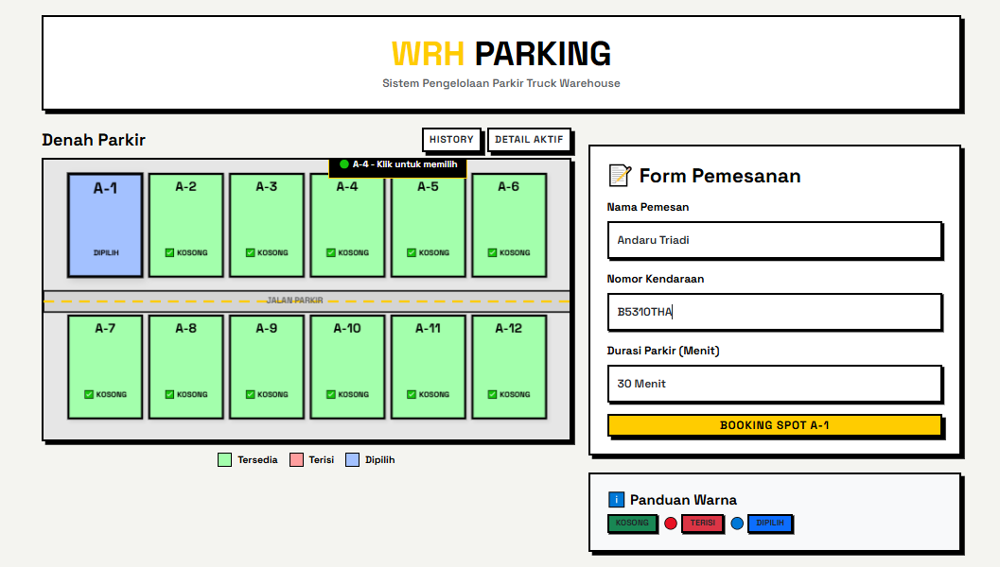
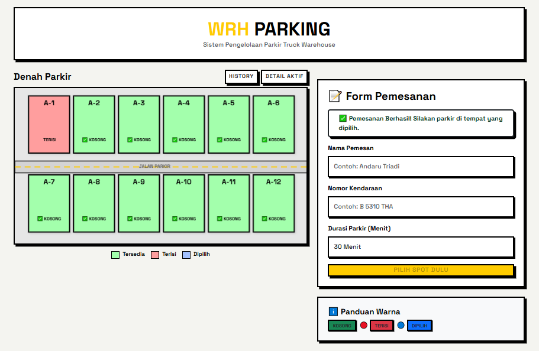
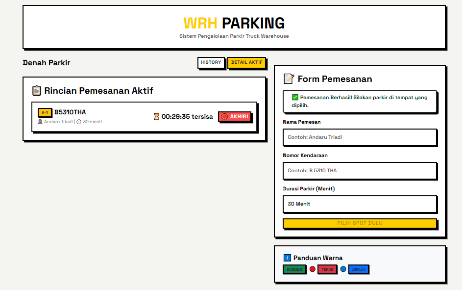
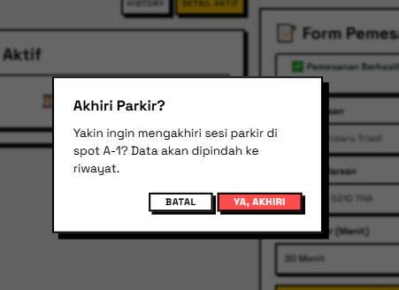
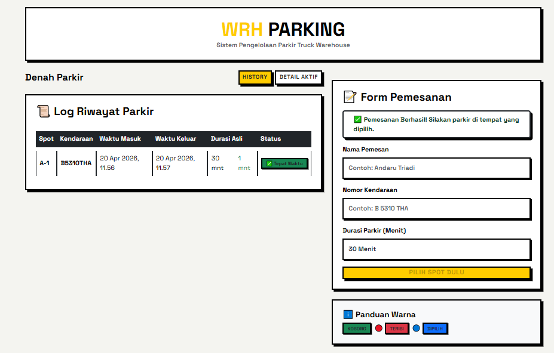

#  WRH Parking - Sistem Pengelolaan Parkir Truck
WRH Parking adalah manajemen parkir truck warehouse dengan denah interaktif berbasis canvas, pemesanan real-time, track durasi otomatis, dan history lengkap. 

##  Fitur Utama
- Denah Parkir Interaktif: Visualisasi spot parkir menggunakan Konva.js.
- Pemesanan Real-time: Form booking dengan validasi input, plat kendaraan, dan durasi parkir.
- Timer Realtime: Hitung mundur waktu tersisa secara real-time sesuai dengan pilihan durasi parkir.
- History Parkir: History lengkap data parkir yang telah selesai.
-  Persistent Data: Data booking & riwayat tersimpan aman di `localStorage`, tetap tersedia setelah refresh atau tutup browser.
- Responsive: Layout adaptif untuk Desktop, Tablet, dan Mobile menggunakan Bootstrap Grid + Flexbox

## Tech Stack
- React 18 + Vite
- Konva.js
- Bootstrap 5

##  How to Run
- Pastikan Node.js (v18+) dan npm sudah terinstal di sistem Anda.  
- Tidak memerlukan database eksternal. Semua data dikelola secara lokal via browser `localStorage` (Cukup browser).
- git clone https://github.com/druwrk22/technical-test-golang-react
- cd technical-test-golang-react
- cd frontend-wrh-parking
- npm install
- npm run dev

## Screenshot

